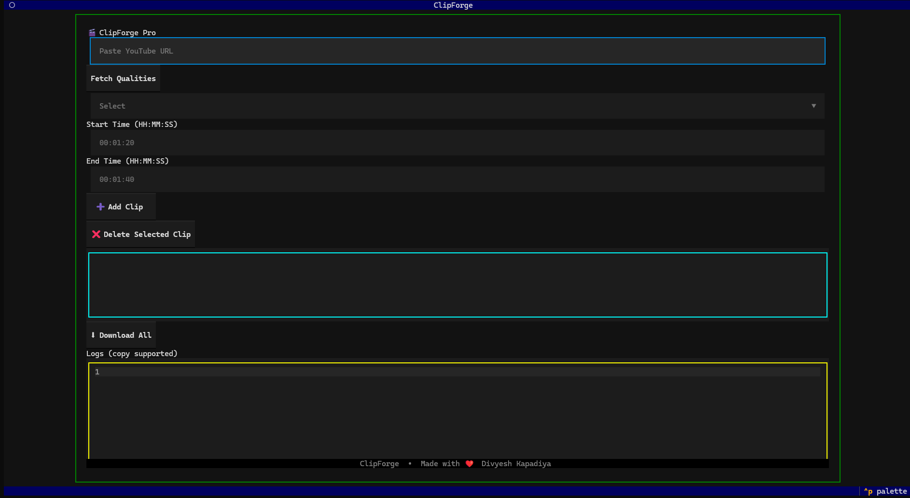

# 🎬 ClipForge — Professional YouTube Multi-Clip Downloader


ClipForge is a fast terminal-based tool to download **multiple clips from any YouTube video** using custom timestamps.

Built for developers, creators and power users who want quick clip extraction without heavy editors.

Supports:

* Linux
* Ubuntu
* WSL
* Termux (Android)


# ⚡ Features

* Download multiple clips from one video
* Quality selection (Best / 1080p / 720p etc)
* Raw live download logs
* Clean terminal UI
* Auto rename clips
* Linux + Termux compatible
* Update-safe installer script

# 🖼 UI Snapshot


# 🚀 Installation

## 📱 Termux Setup (Android)

### 1️⃣ Install Termux & Setup Storage

Install Termux from Play Store: [https://play.google.com/store/apps/details?id=com.termux](https://play.google.com/store/apps/details?id=com.termux)

Open Termux and run:

```bash
termux-setup-storage
```

Allow storage permission, then go to Downloads folder:

```bash
cd ~/storage/downloads
```

### 2️⃣ One-Line Install Command (Run Once)

```bash
pkg update -y && pkg upgrade -y && pkg install git python ffmpeg deno -y && pip install -U yt-dlp-ejs && pip install yt-dlp textual rich && git clone https://github.com/divyesh255/ClipForge-Professional-YouTube-Multi-Clip-Downloader.git && cd ClipForge-Professional-YouTube-Multi-Clip-Downloader
```

This will:

* Install all dependencies
* Clone project
* Prepare environment

### 3️⃣ Run the Tool

```bash
python3 main.py
```

### 4️⃣ If YouTube Updates and Tool Stops Working

Run update command:

```bash
pkg update -y && pkg upgrade -y && pip install -U yt-dlp-ejs && pip install -U yt-dlp
```

Then run the tool again:

```bash
python3 main.py
```

### 💡 Notes

* Always run tool inside Termux
* All downloaded clips will be saved in your File Manager → Download folder → ClipForge-Professional-YouTube-Multi-Clip-Downloader
* Works on Android 11+
* No root required
* If download fails → run update command above
* NodeJS is used as JS runtime for yt-dlp

## 📱  Linux/Ubuntu/WSL Setup

Run installer script:
```
$ git clone https://github.com/divyesh255/ClipForge-Professional-YouTube-Multi-Clip-Downloader.git
$ cd ClipForge-Professional-YouTube-Multi-Clip-Downloader
$ chmod +x install.sh
$ ./install.sh
```

This installs:

* yt-dlp
* ffmpeg
* textual UI
* nodejs
* dependencies

### ▶️ Run Tool
```
$ python3 main.py
```
### 🔄 If YouTube Updates and Tool Stops Working
```
$ ./install.sh
```

This updates:

* yt-dlp
* dependencies

# 🧠 Usage

1. Paste YouTube link
2. Fetch quality
3. Select quality
4. Enter start & end time
5. Add clips
6. Download all

Time format:
HH:MM:SS

Example:
00:01:20 → 00:01:40

# 🤝 Contributing

Feel free to:

* Create pull requests
* Improve code
* Design a more professional UI
* Add new features
* Optimize performance
* Fix bugs

Any meaningful improvement is welcome 🚀

# 📩 Support / Queries

For any queries or suggestions drop an email:

[divyeshkapadiya25@gmail.com](mailto:divyeshkapadiya25@gmail.com)

# ⚠️ License & Usage

This tool is generated for the **open-source community**.

Do not use this project for commercial purposes without permission.


# ⭐ Support

If you like this project:

* Star the repo
* Improve it
* Share with devs

Let's build something powerful together.

---
Made with ❤️ by Divyesh Kapadiya
